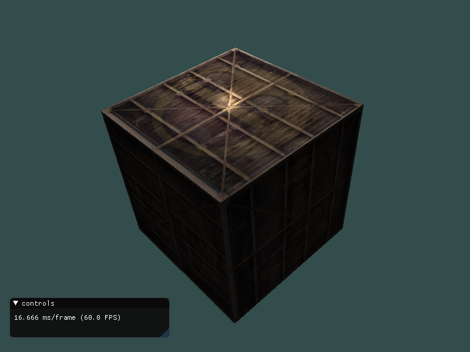

## 基础光照


### 环境光

```glsl
void main()
{
    float ambientStrength = 0.1;
    vec3 ambient = ambientStrength * lightColor;

    vec3 result = ambient * objectColor;
    FragColor = vec4(result, 1.0);
}
```

### 漫反射

```glsl
#version 330 core
out vec4 FragColor;
in vec3 outNormal;//法向量
in vec3 outFragPos; // 片元位置

uniform vec3 lightPos;//光照位置
uniform vec3 viewPos; // 视线方向

void main()
{
    // 环境光常量
    float ambientStrength = 0.1;
    vec3 ambient = ambientStrength * lightColor;
		
    vec3 norm = normalize(outNormal); // 法向量单位化
    vec3 lightDir = normalize(lightPos - outFragPos); // 片元位置指向光照方向

    float diff = max(dot(norm, lightDir), 0.0); // 漫反射分量
    vec3 diffuse = diff * lightColor; // 漫反射
	
    vec3 result = (ambient + diffuse) * objectColor;
    
    FragColor = vec4(result, 1.0);
}
```

### 镜面光

```glsl
#version 330 core
out vec4 FragColor;
in vec3 outNormal;//法向量
in vec3 outFragPos; // 片元位置

uniform vec3 lightPos;//光照位置
uniform vec3 viewPos; // 视线方向

void main()
{
    // 环境光常量
    float ambientStrength = 0.1;
    vec3 ambient = ambientStrength * lightColor;
		
    vec3 norm = normalize(outNormal); // 法向量单位化
    vec3 lightDir = normalize(lightPos - outFragPos); // 片元位置指向光照方向

    float diff = max(dot(norm, lightDir), 0.0); // 漫反射分量
    vec3 diffuse = diff * lightColor; // 漫反射
    
    float specularStrength = 0.9;
    vec3 viewDir = normalize(viewPos - outFragPos); // 视线方向
    vec3 reflectDir = reflect(-lightDir, norm); // 沿法向量反射

    float spec = pow(max(dot(viewDir, reflectDir), 0.0), 256);
    vec3 specular = specularStrength * spec * lightColor; // 镜面光

	
    vec3 result = (ambient + diffuse + specular) * objectColor;
    
    FragColor = vec4(result, 1.0);
}
```


### 效果




## 参考

[漫反射光照](https://learnopengl-cn.github.io/02%20Lighting/02%20Basic%20Lighting/#_3)
