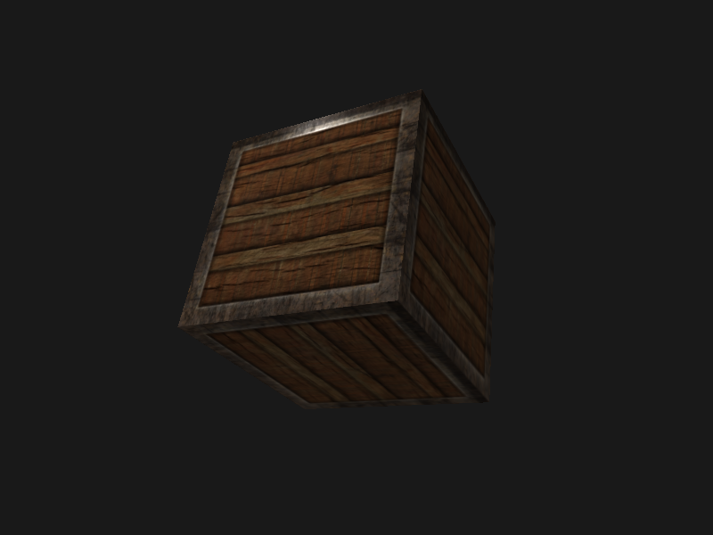

## 光照贴图

```glsl
#version 330 core
out vec4 FragColor;
in vec2 outTexCoord;
in vec3 outNormal;
in vec3 outFragPos;

uniform vec3 lightColor;
uniform vec3 lightPos;
uniform vec3 viewPos; // 相机位置

// 定义材质结构体
struct Material {
  sampler2D diffuse; // 漫反射贴图
  sampler2D specular; // 镜面光贴图
  float shininess; // 高光指数
};
uniform Material material;

// 光源属性
struct Light {

  vec3 ambient;
  vec3 diffuse;
  vec3 specular;
};

uniform Light light;

void main() {

  vec4 objectColor = vec4(1.0f, 1.0f, 1.0f, 1.0f);
  vec3 diffuseTexture = vec3(texture(material.diffuse, outTexCoord));
  vec3 specularTexture = vec3(texture(material.specular, outTexCoord));

  vec3 ambient = light.ambient * diffuseTexture; // 环境光

  vec3 norm = normalize(outNormal);
  vec3 lightDir = normalize(lightPos - outFragPos);

  float diff = max(dot(norm, lightDir), 0.0);
  vec3 diffuse = light.diffuse * diff * diffuseTexture; // 漫反射

  vec3 viewDir = normalize(viewPos - outFragPos);
  vec3 reflectDir = reflect(-lightDir, norm);

  float spec = pow(max(dot(viewDir, reflectDir), 0.0), material.shininess);
  vec3 specular = light.specular * spec * specularTexture; // 镜面光

  vec3 result = (ambient + diffuse + specular) * vec3(objectColor);

  FragColor = vec4(result, 1.0);
}
```


### 效果



## 参考

[漫反射贴图](https://learnopengl-cn.github.io/02%20Lighting/04%20Lighting%20maps/#_2)
