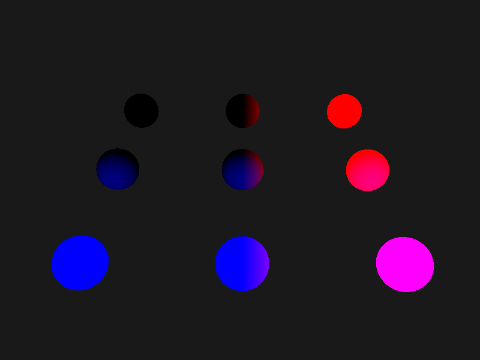
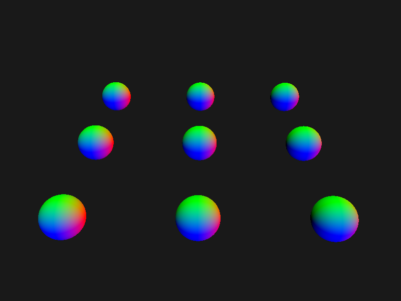
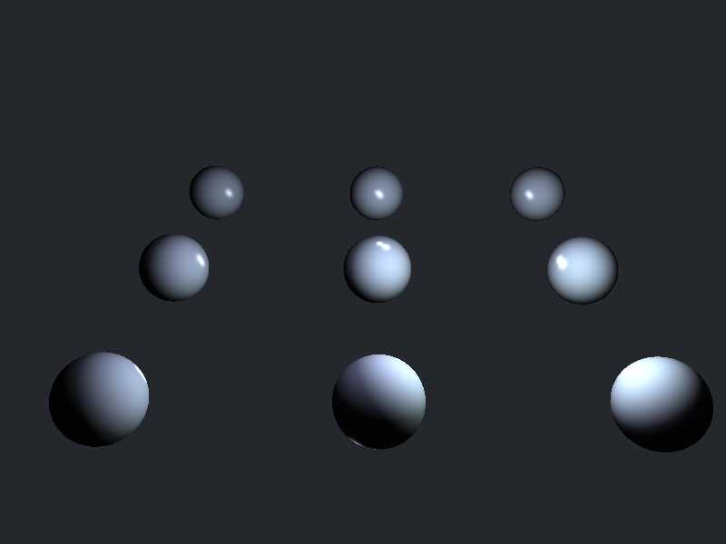

## 延迟渲染

**position**



**normal**



获取position和normal就可以通过这些缓冲里的数据计算光照

>延迟渲染需要关闭混合
>
>```c++
>
>// // 启用混合
>// glEnable(GL_BLEND);
>// glBlendFunc(GL_SRC_ALPHA, GL_ONE_MINUS_SRC_ALPHA);
>```

**计算光照**




**延迟渲染结合正向渲染**

需要将`gBuffer`的深度缓冲复制到默认缓冲中，否则会出现后面绘制的物体无法显示或者深度信息不正确的问题

```c++
// 延迟结合正向渲染
glBindFramebuffer(GL_READ_FRAMEBUFFER, gBuffer);
glBindFramebuffer(GL_DRAW_FRAMEBUFFER, 0); // 指定默认的帧缓冲为写缓冲
// 复制gbuffer的深度信息到默认帧缓冲的深度缓冲
glBlitFramebuffer(0, 0, SCREEN_WIDTH, SCREEN_HEIGHT, 0, 0, SCREEN_WIDTH, SCREEN_HEIGHT, GL_DEPTH_BUFFER_BIT, GL_NEAREST);
glBindFramebuffer(GL_FRAMEBUFFER, 0);
```

**绘制灯光物体**


## 参考

[延迟着色法](https://learnopengl-cn.github.io/05%20Advanced%20Lighting/08%20Deferred%20Shading/#_1)

